# Yakut's Blog

Proje, .NET Core MVC kullanılarak geliştirilmiş bir web uygulamasıdır. Bu uygulama, bir blog platformu olarak tasarlanmıştır. Ziyaretçiler, kayıtlı kullanıcılar tarafından oluşturulan içerikleri görüntüleyebilir ve bu içeriklere yapılan yorumları okuyabilirler. İçerik oluşturmak veya yorum yapmak isteyen kullanıcılar sisteme kayıt olmak zorundadır. Kayıt olan ve giriş yapan kullanıcılar, içerik oluşturabilir ve yorum yapabilirler. Oluşturulan içerikler admin tarafından incelenir ve onaylanırsa yayımlanır.

The project is a web application developed using .NET Core MVC. This application is designed as a blogging platform. Visitors can view content created by registered users and read comments on this content. Users who want to create content or comment must register with the system. Registered and logged-in users can create content and comment. The content created is reviewed by the admin, and if approved, it is published. (EN)

## Proje İçeriği - Project Content

- EF Core
- Seed Database
- MSSql Database Provider 
- Repository Pattern
- CRUD
- Url Parameters
- Add Comment
- AJAX Request
- Authentication
- Authorization
- Claims
- Login-Register Operations
- Many to Many Relations

## Proje Ekran Görüntüleri (Screenshots)

## Postların Listelenmesi:
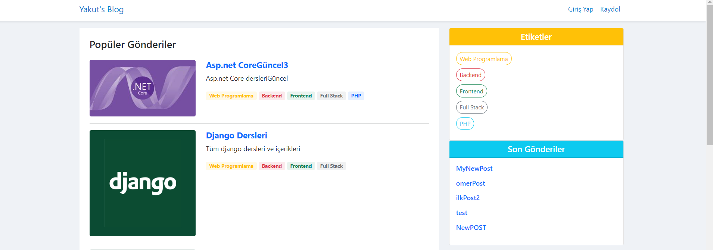

## Post Detayı:
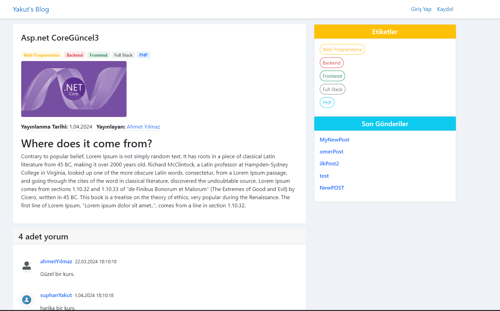

## Posta Yapılan Yorumların Görüntülenmesi:
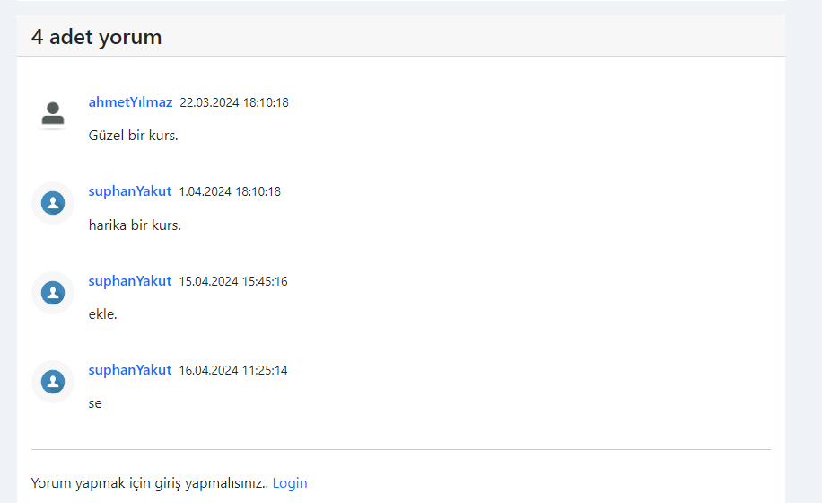

## Kayıt Ekranı:
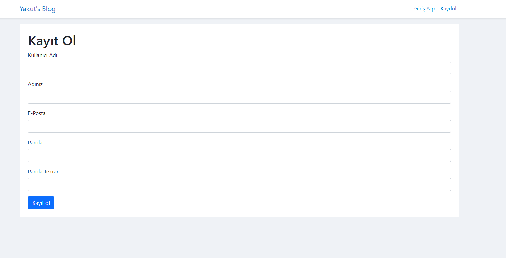

## Giriş Ekranı:
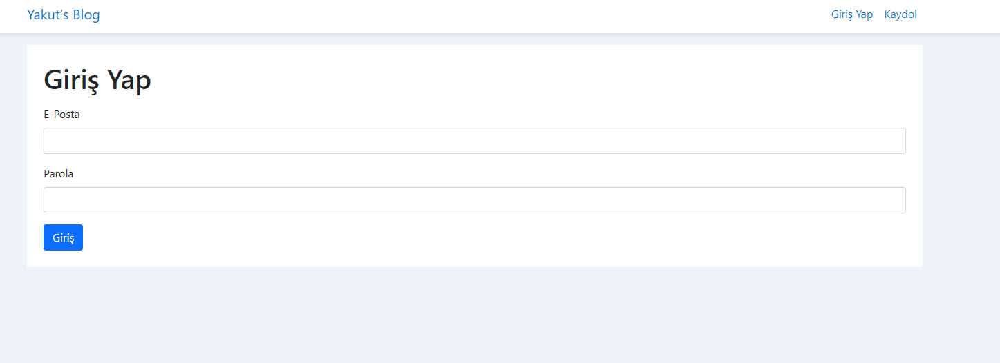

## Girişten Sonra NavBar'da Kullanıcı Bilgileri Gösterilmesi Ekranı:
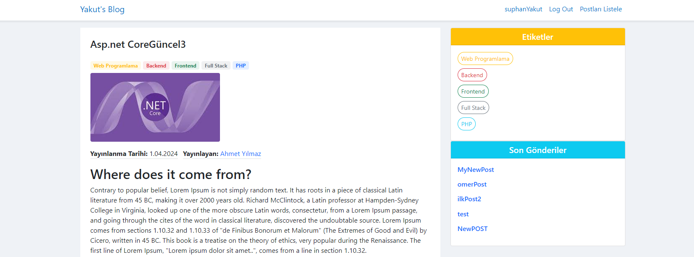

## Giriş Yaptıktan Sonra Yorum Ekleme:
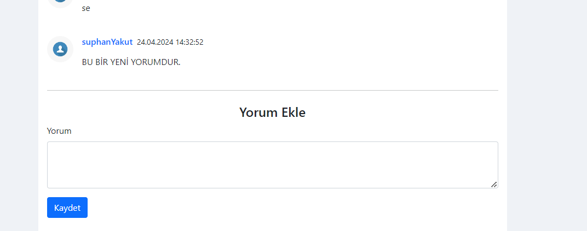

## Kullanıcın Gönderdiği Postları Editleme İşlemi ( Yeni Post da ekleyebilir.)
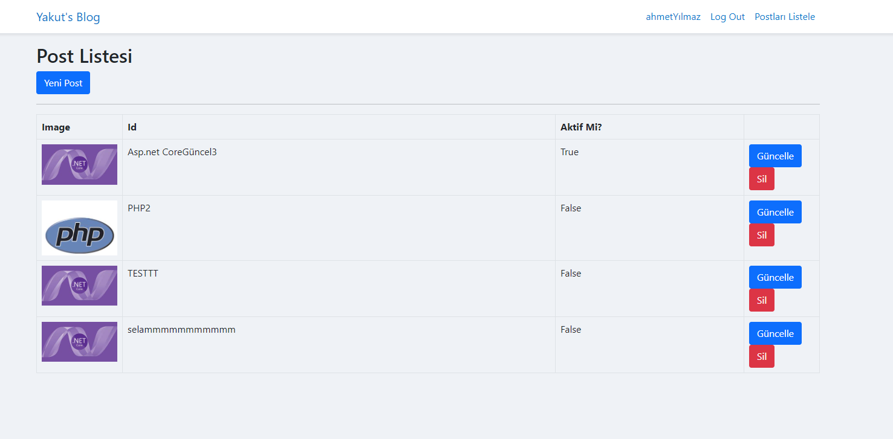

## Post Oluşturma Ekranı
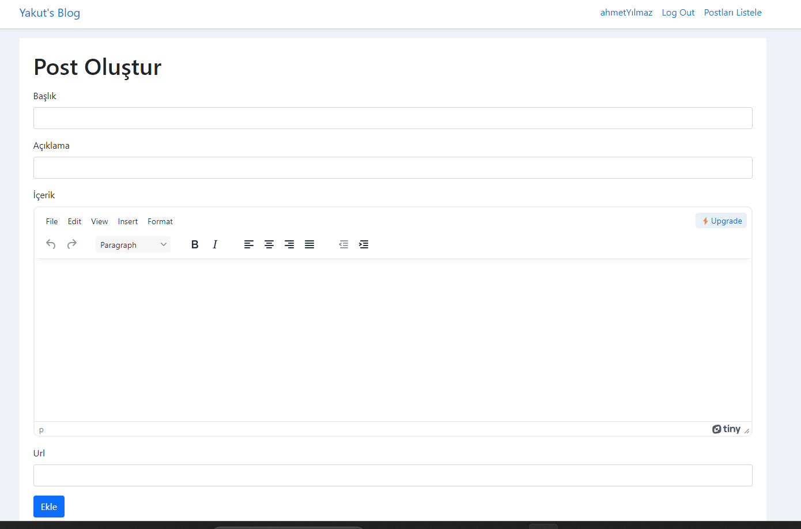

## Kullanıcı Profil Sayfası:
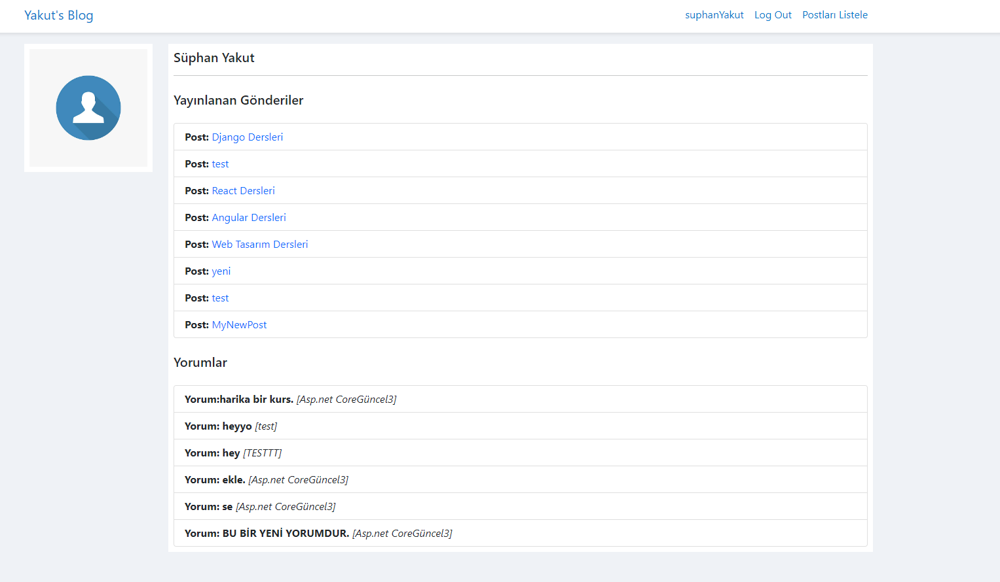

## Başka Bir Kullanıcı Profil Sayfası:
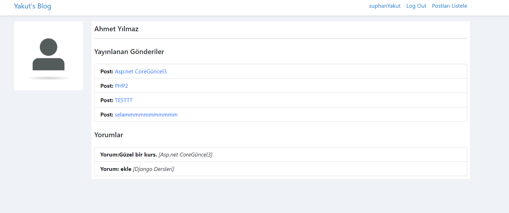

